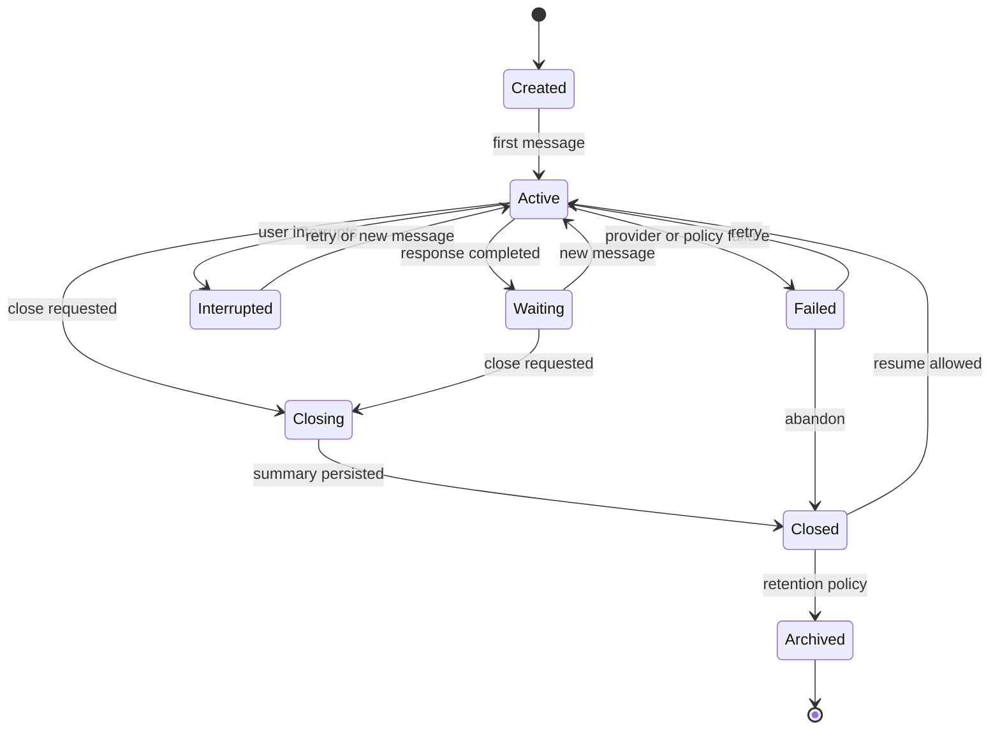
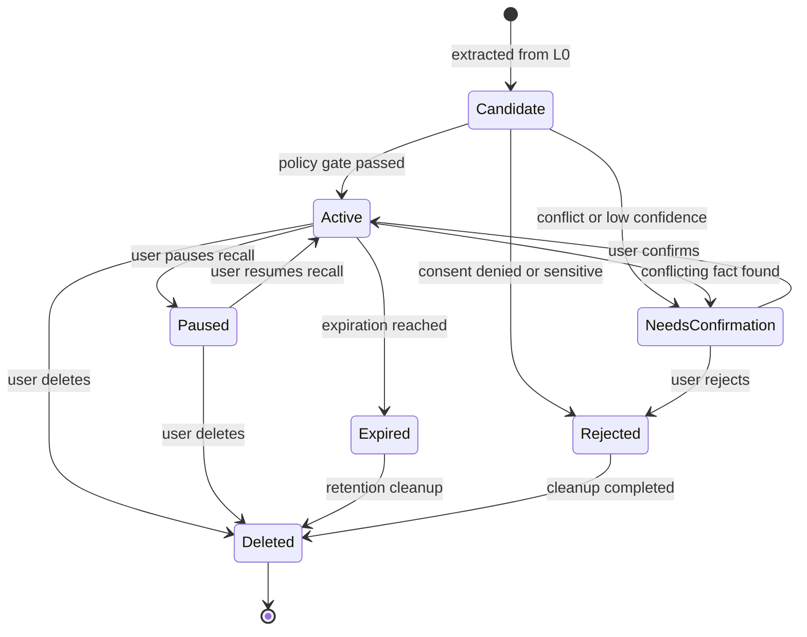
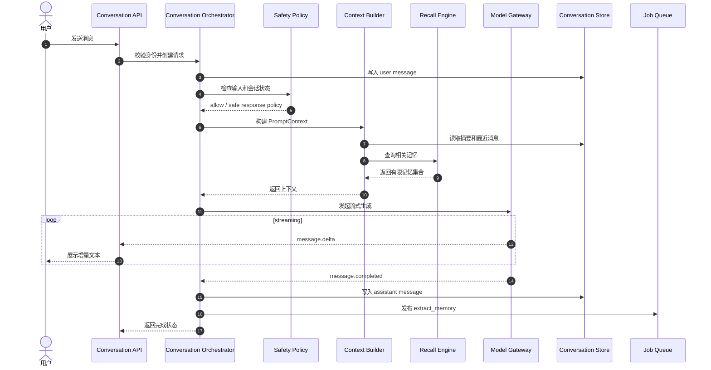
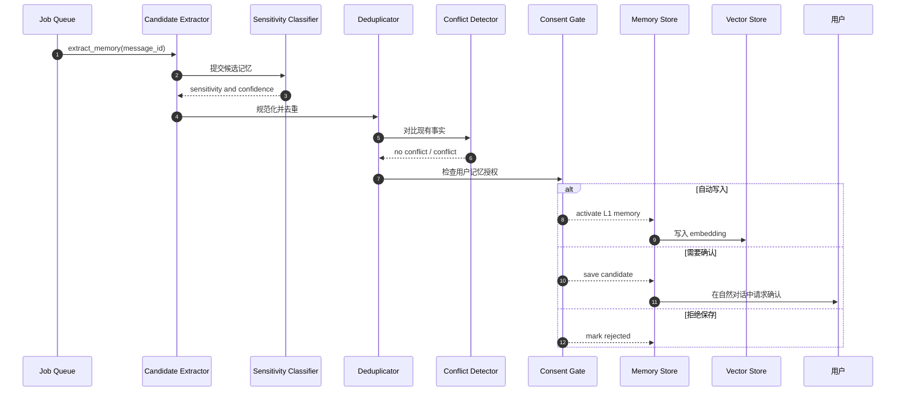
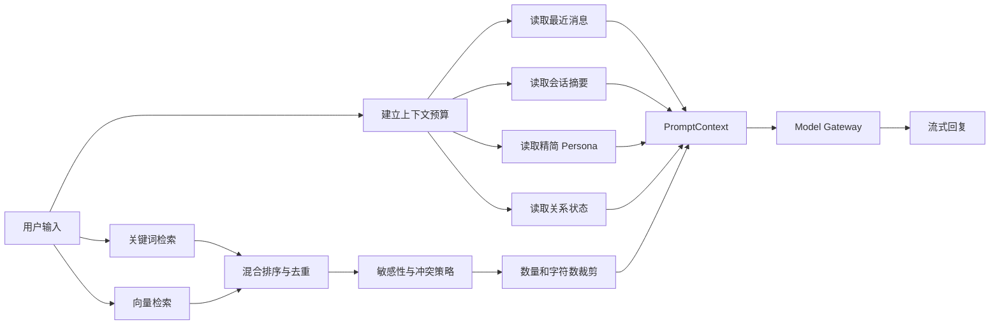
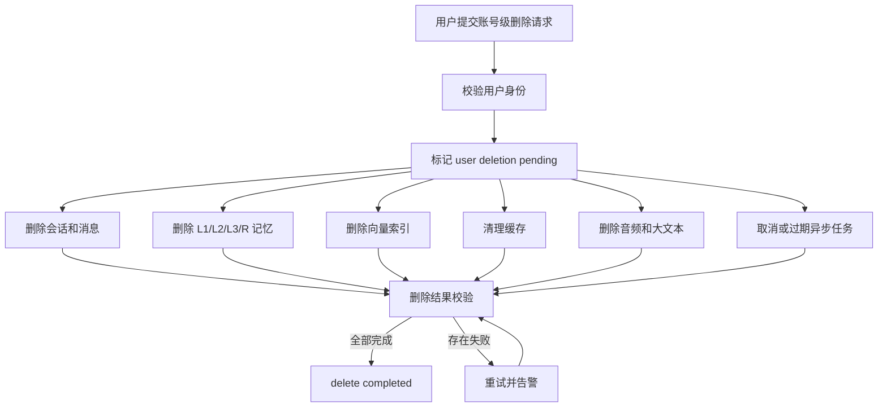
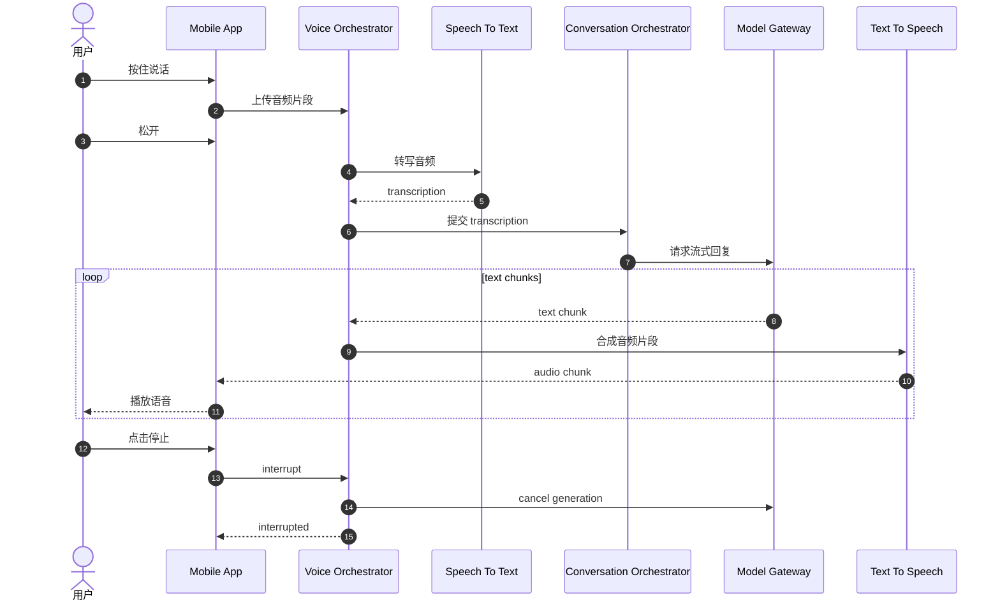

# Companion 核心 UML 图

> 文档状态：Draft  
> 文档版本：0.1  
> 对应文档：`design.md`、`tech.md`  
> 更新日期：2026-08-08

本文档只保留核心状态、时序和流程图。节点名称与技术文档中的领域模型保持一致，具体字段以 `tech.md` 为准。

## 1. 会话状态图



## 2. 记忆生命周期状态图



## 3. 文本对话时序图



## 4. 记忆抽取与写入时序图



## 5. 上下文召回流程图



## 6. 账号级数据删除流程图



## 7. 语音交互时序图



## 8. 图之间的关系

```text
会话状态图：定义一次会话的生命周期
记忆状态图：定义一条记忆的治理生命周期
对话时序图：定义一次文本请求的在线链路
记忆时序图：定义离线记忆写入和用户确认链路
召回流程图：定义 PromptContext 的组装方式
删除流程图：定义账号级数据删除的闭环
语音时序图：定义 MVP 的语音输入和播放链路
```
