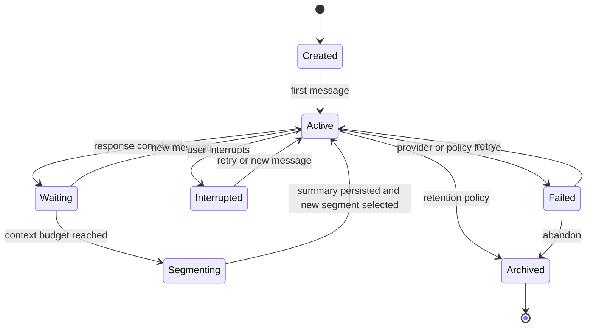
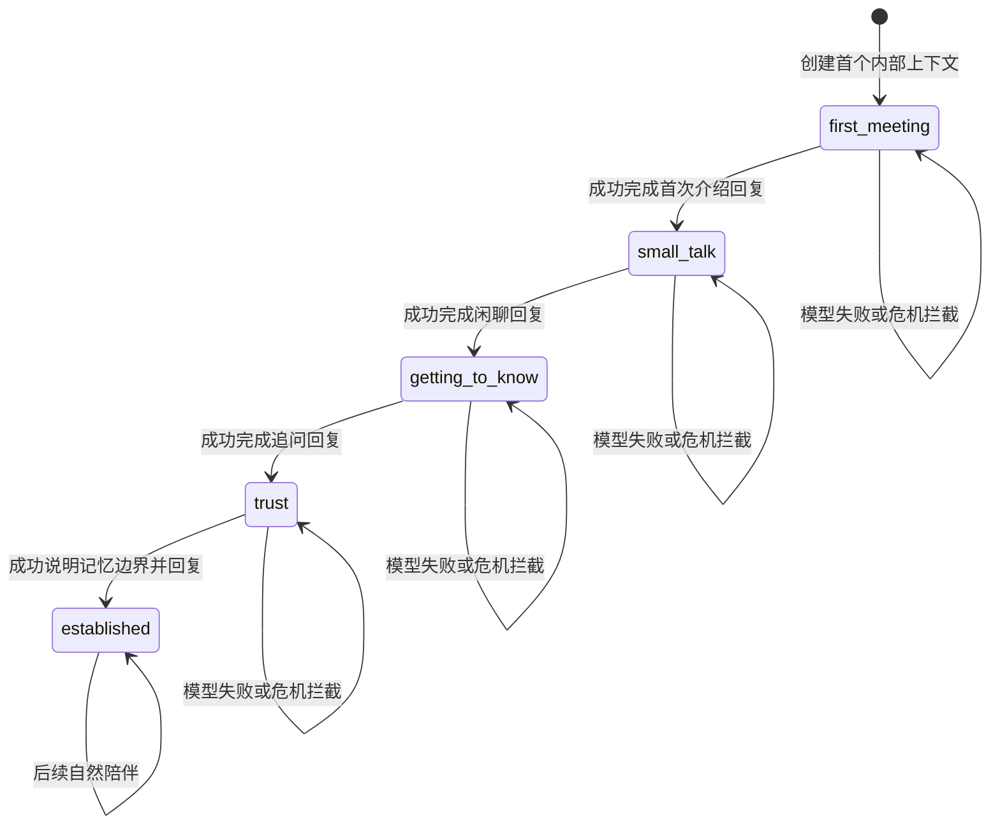
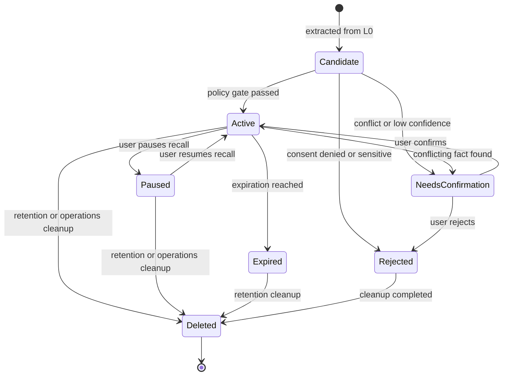
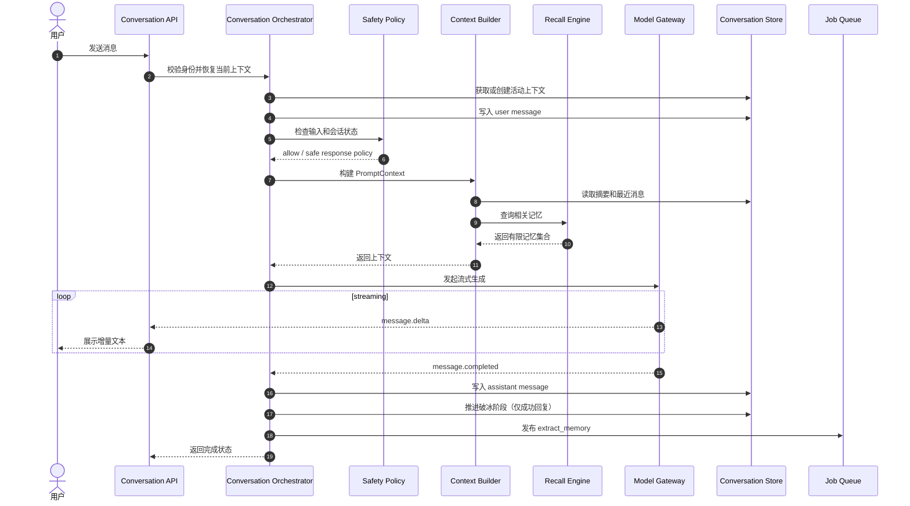
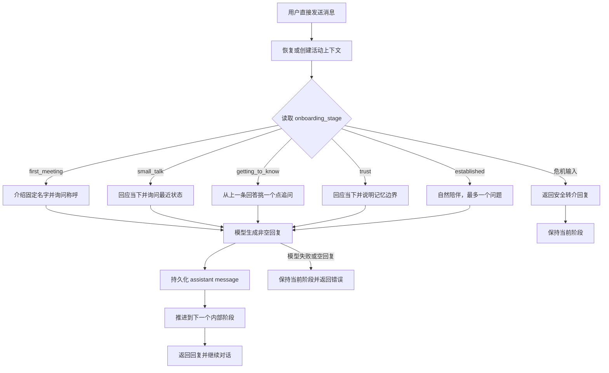
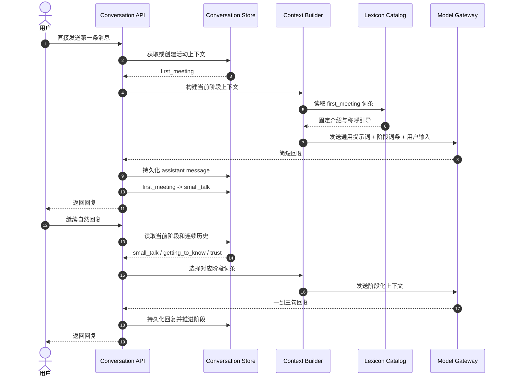
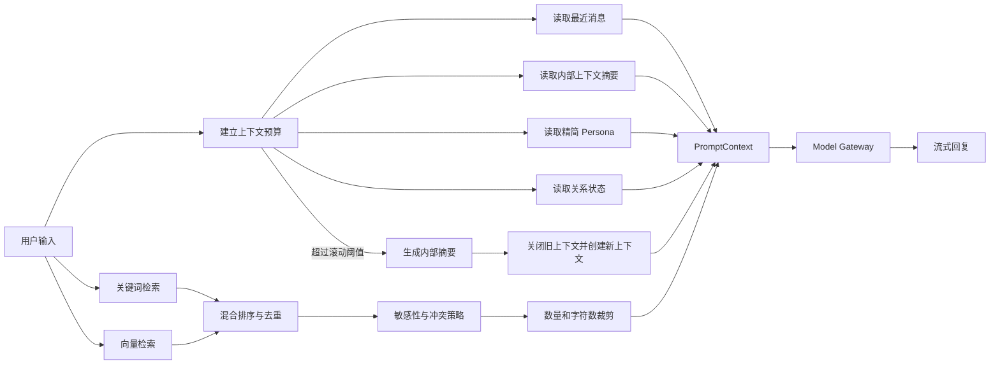
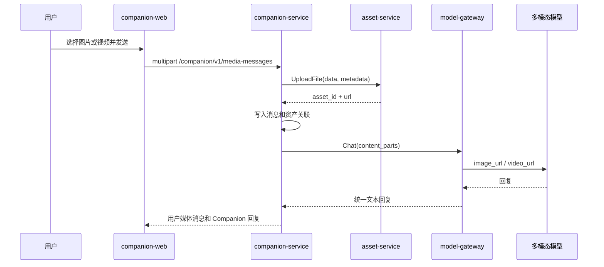
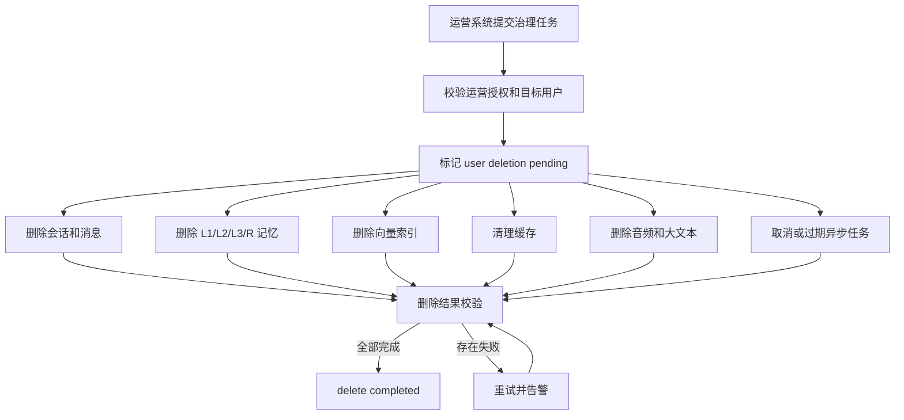
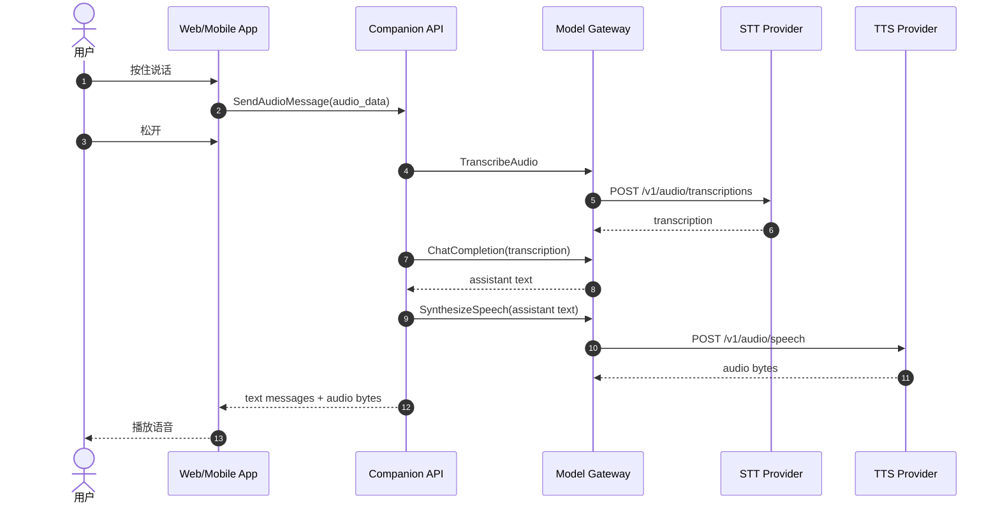

# Companion 核心 UML 图

> 文档状态：Draft  
> 文档版本：0.1  
> 对应文档：`design.md`、`tech.md`  
> 更新日期：2026-08-09

本文档只保留核心状态、时序和流程图。节点名称与技术文档中的领域模型保持一致，具体字段以 `tech.md` 为准。

## 1. 会话状态图



## 2. 破冰阶段状态图



阶段字段只由 `companion-service` 内部维护，不进入 HTTP/gRPC 响应；只有模型回复生成并持久化成功后才推进，危机安全回复不推进阶段。

阶段与用户体验的对应关系：`first_meeting` 负责互报名字，`small_talk` 负责探测状态，`getting_to_know` 负责基于上一条回答追问一个具体点，`trust` 负责自然说明记忆边界，`established` 进入普通陪伴。用户看不到状态字段，也不会被要求创建或切换会话。

## 3. 记忆生命周期状态图



## 4. 文本对话时序图



## 5. 自然破冰对话流程图



## 6. 自然破冰时序图



## 7. 记忆抽取与写入时序图


## 8. 上下文召回流程图



## 9. 图片和视频消息时序图



## 10. 运营侧账号级数据治理流程图



## 11. 语音交互时序图



## 12. 图之间的关系

```text
会话状态图：定义一次会话的生命周期
破冰阶段状态图：定义首次社交过程的服务端节奏
记忆状态图：定义一条记忆的治理生命周期
对话时序图：定义一次文本请求的在线链路
记忆时序图：定义离线记忆写入和用户确认链路
召回流程图：定义 PromptContext 的组装方式
运营治理流程图：定义内部账号级数据删除的闭环，用户侧不暴露对应 API
语音时序图：定义 MVP 的语音输入和播放链路
```
